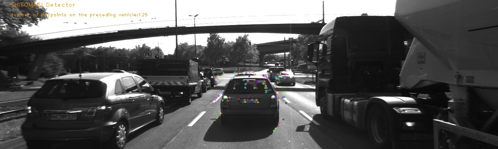
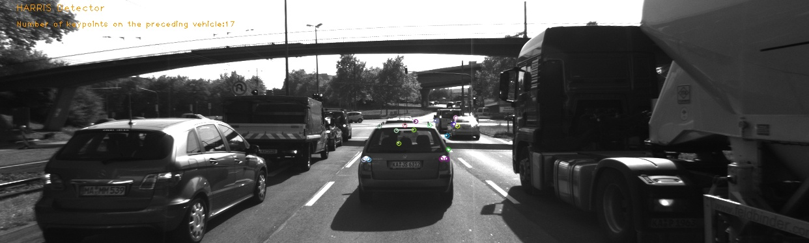
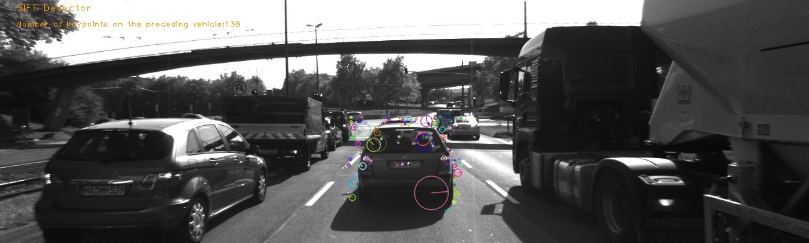
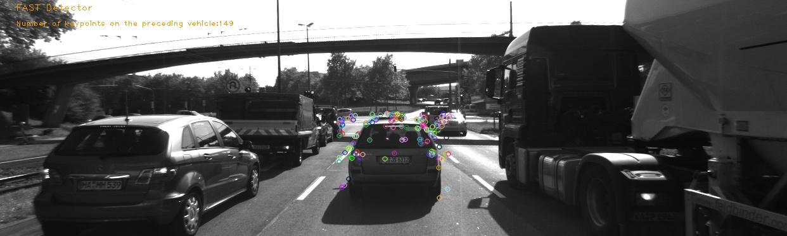
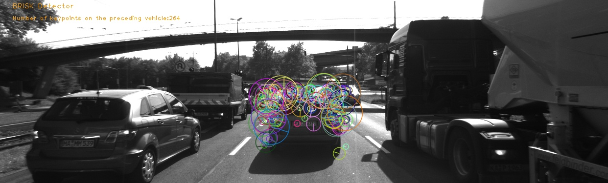
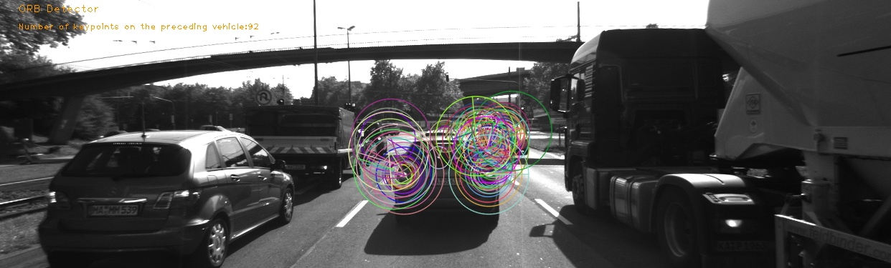
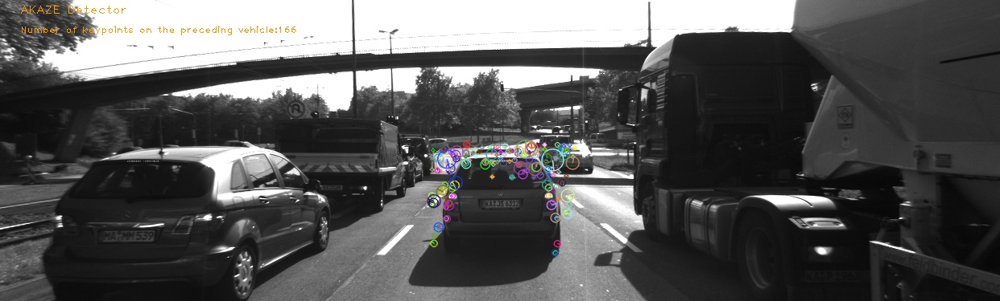

# Udacity Sensor Fusion Nanodegree

## Data Buffer Optimization
- STL C++ container [deque](https://en.wikipedia.org/wiki/Double-ended_queue) is used to implement the data buffer.
## Keypoint Detection
- SHITOMASI, HARRIS, FAST, BRISK, ORB, AKAZE, and SIFT detectors are utilized for features detection and made selectable by setting a string accordingly.
## Keypoint Removal
- All keypoints outside of a pre-defined rectangle(preceding vehicle) are removed and only the keypoints within the rectangle are considered for further processing.
## Keypoint Descriptors
* BRISK, BRIEF, ORB, FREAK, AKAZE and SIFT descriptors  implemented and made selectable by setting a string accordingly.
## Descriptor Matching
* FLANN matching as well as k-nearest neighbor selection are implemented. Both methods are selectable using the respective strings in the main function.
* In the Brute force matching, the metric used for matching keypoints is L2 norm for HOG based descriptors(SIFT) and Hamming distance for binary based descriptors(BRIEF, BRISK, ...etc).
## Descriptor Distance Ratio
* The 2-Nearest-Neighbor underwent the ratio test, to decide whether the 1-NN is much better than the 2-NN and can be selected as a match or there are many ambigous similar matches and thus 1-NN can be rejected.

## Performance Evaluation 1

#### Number of keypoints detected on the preceding vehicle:
| Detector   | avg. P.V.K | avg. P.V.K/ avg. T.D.K (%) |Notes on the keypoints |
|------------|------------|----------------------------|---------|
| SHI-TOMASI | 118        | 9                          |  well distributed  |
| HARRIS     | 25         | 15                         |  well distributed (zero overlapping) |
| SIFT       | 139        | 10                         |   well distributed  |
| FAST       | 149        | 8                          |  some clusters and overlapping  | 
| BRISK      | 276        | 10                         |   some clusters and overlapping |
| ORB        | 116        | 23                         | some clusters and overlapping |
| AKAZE      | 167        | 12                         |  scattered in a certain area |

P.V.K: Keypoints detected on the preceding vehicle.

T.D.K: Total detected keypoints. 
___

## Performance Evaluation 2

#### Average number of matched keypoints:
| Detector\Descriptor | BRISK | BRIEF | ORB | FREAK | AKAZE | SIFT |
|---------------------|:-----:|:-----:|:---:|:-----:|:-----:|:----:|
| SHI-TOMASI           |   85  |  105  | 101 |   85  |   _   |  103 |
| HARRIS              |   16  |   19  |  18 |   16  |   _   |  18  |
| SIFT                |   66  |   78  |  _  |   66  |   _   |  89  |
| FAST                |  100  |  122  | 120 |   98  |   _   |  116 |
| BRISK               |  174  |  189  | 168 |  170  |   _   |  183 |
| ORB                 |   83  |   61  |  85 |   47  |   _   |  85  |
| AKAZE               |  135  |  141  | 132 |  132  |  140  |  141 |

## Performance Evaluation 3
#### Average detector/descriptor processing time:
| Detector\Descriptor | BRISK | BRIEF |  ORB | FREAK | AKAZE |  SIFT |
|---------------------|:-----:|:-----:|:----:|:-----:|:-----:|:-----:|
| SHI-TOMASI          |  14.8 |  13.5 | 15.8 |   32  |   _   |  29.5 |
| HARRIS              |  14.8 |   14  | 16.2 |  32.7 |   _   |  29.2 |
| SIFT                |  76.7 |  76.2 |   _  |  95.3 |   _   | 126.9 |
| FAST                |  2.7  |  1.7  |  3.5 |  23.4 |   _   |  16.7 |
| BRISK               |  64.4 |  61.1 | 71.5 |  85.2 |   _   |  85.1 |
| ORB                 |  9.1  |   8   | 17.3 |  30.3 |   _   |  32.4 |
| AKAZE               |  63.4 |   61  | 69.1 |  80.5 |  12.9 |   73  |

As expected the binary based detectors/descriptors required less processing time. Based on the recoreded data, The best three detector/descriptor combinations with respect to the total processing time are FAST|BRIEF, FAST|BRISK, and FAST|ORB. 
